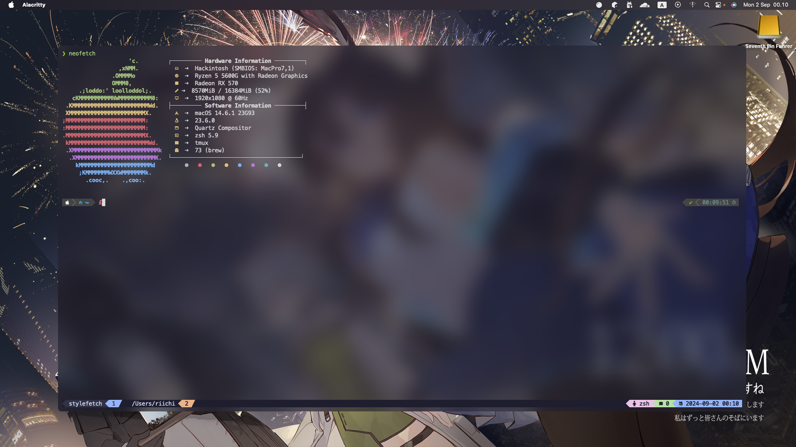
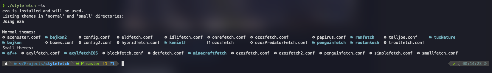
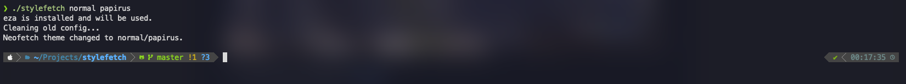
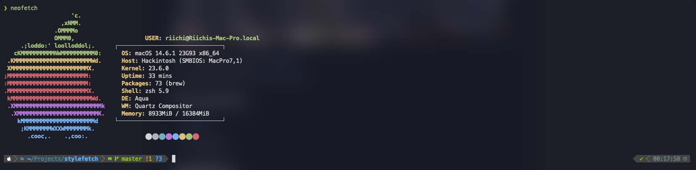

# stylefetch



> A simple theming wrapper for [neofetch](https://github.com/dylanaraps/neofetch?)

Themes are imported from [neofetch-themes](https://github.com/Chick2D/neofetch-themes)

## Prerequisites

- [neofetch](https://github.com/dylanaraps/neofetch?)
- [git](https://git-scm.com/)
- [eza](https://github.com/eza-community/eza) (optional)

## Installation

```sh
git clone https://github.com/billyaddlers/stylefetch
cd stylefetch

./stylefetch --install
```

## Usage

### Check for available themes

```sh
stylefetch --list
stylefetch -ls
```



### Apply a theme

```sh
stylefetch <a> <b>
stylefetch normal papyrus
```



### Get [stylish](stylish_bandit_slayer.jpg)!

```sh
neofetch
```



## Contributing

Just do what the fudge you want to, me couldn't care less.

## License

This project is licensed under the MIT License. See the [LICENSE.md](LICENSE.md) file for details.
